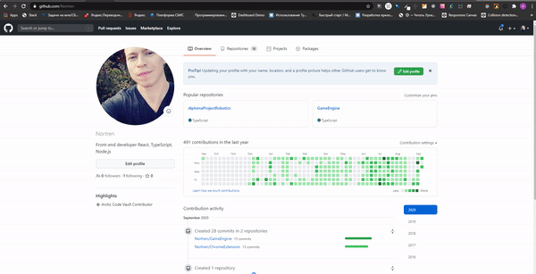

# Chrome Extension
___
Need create a simple extension for Chrome which do the following:

Adds an item to the context menu, which is shown when the context menu is called on selection.

If a user activates the menu item, the extension shows the selected text in the separate chrome tab.

Chrome JS API uses callbacks. Offer the solution which will provide the way to use this API with promises. Use this solution in part 1.

PS All docs on chrome extensions, chrome API, etc. the candidate must find himself.
___
### Example of work

